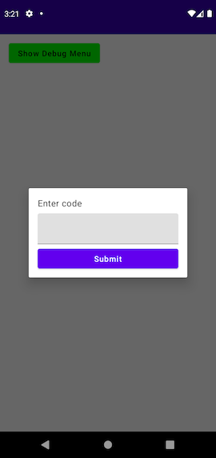
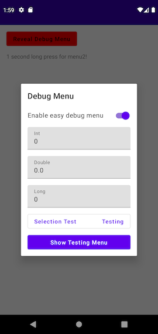
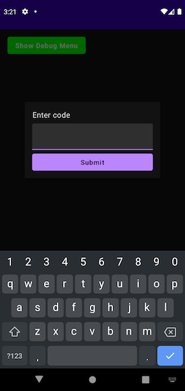
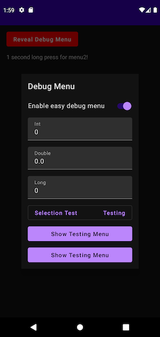

# debug-menu-android
A simple way to deploy a password-protected debug menu to your app.


This repo includes 5 modules:

**app** - A sample app demonstrating usage of the menu.

**debugmenu-core** - The core framework for the debug menu, written in pure Kotlin

**debugmenu-sharedprefs** - A persistence layer for debugmenu that can be used on Android, based on Datastore Preferences

**debugmenu-ui** - A UI layer for debugmenu that can be used on Android, written in Jetpack Compose and hosted in a DialogFragment.

**debugmenu-codegen** - The annotations and annotation processor used for compile-time safe usage of the menu.







# Installation
[](https://jitpack.io/#steamclock/debug-menu-android)

1. Add this in your **root** build.gradle at the end of repositories:
```gradle
allprojects {
    repositories {
        // other repositories
        maven { url 'https://jitpack.io' }
    }
}
``` 

2. Add dependencies in your app module's build.gradle:
```gradle
// only necessary if you're using the annotations
plugins {
    id 'kotlin-kapt'
}

dependencies {
    implementation "com.github.steamclock.debug-menu-android:core:<VERSION>"
    implementation "com.github.steamclock.debug-menu-android:sharedprefs:<VERSION>"
    implementation "com.github.steamclock.debug-menu-android:compose:<VERSION>"

    // these two dependencies are only necessary if you're using the annotations
    kapt "com.github.steamclock.debug-menu-android:codegen:<VERSION>"
    implementation "com.github.steamclock.debug-menu-android:annotation:<VERSION>"
}
```
Most recent version can be found [here](https://github.com/steamclock/debug-menu-android/releases)

3. Sync your project gradle files

4. DebugMenu should now be available in the project.

# Usage
## Initialization

In order to initialize the DebugMenu, you'll need to generate the SHA-256 encoding for a passcode of your choosing, then enter that in the DebugMenu initialization:
```kotlin
class App: Application() {
    override fun onCreate() {
        super.onCreate()
        DebugMenu.initialize("5e884898da28047151d0e56f8dc6292773603d0d6aabbdd62a11ef721d1542d8",
            ComposeDebugMenuDisplay(this),
            SharedPrefsPersistence(this)
        )
    }
}
```

For the example above, I used https://emn178.github.io/online-tools/sha256.html to enter `password`.
From here, you're ready to start adding options.

Currently the following options are supported:
| `DebugOption`    | UI Shown | Default Value |
|-------------------|-------------------------------------------|-------|
| `BooleanValue`    | A true/false toggle                       | `false` |
| `IntValue`        | An input field for integer values         | `0`     |
| `DoubleValue`     | An input field for double values          | `0.0`   |
| `LongValue`       | An input field for long values            | `0L`    |
| `Action`          | A button that will call the code provided | n/a   |
| `OptionSelection` | A drop-down menu of string values         | `null`  |

## Manual Usage
### Adding Options

You can add an option to the menu at runtime using 
`DebugMenu.instance.addOptions(vararg newOptions: DebugOption)` 
or
`DebugMenu.instance.addOptions(menuKey: String, vararg newOptions: DebugOption)`.

Specifying a `menuKey` will allow you to split debug options into separate menus as the app grows.

```kotlin
class MainActivity : AppCompatActivity() {
    override fun onCreate(savedInstanceState: Bundle?) {
        super.onCreate(savedInstanceState)
        runBlocking {
            DebugMenu.instance.addOptions(
                BooleanValue(
                    title = "Test toggle", // The title shown in the debug menu
                    key = "test-toggle", // the key used to persist this value,
                    defaultValue = false // optional param
                ),
                Action(
                    title = "Test action",
                    onClick = {
                        // note, Action.onClick is a suspending function, 
                        // so we can invoke other suspending functions here
                        testAction()
                    }
                ),
                OptionSelection(
                    title = "Test Selection",
                    key = "test-selection",
                    options = listOf("value1", "value2"),
                    defaultIndex = null
                )
            )    
        }
    }
}
```

### Reading Debug Values
DebugMenu provides options as either a Kotlin Flow, with some convenience functions for reading a single value.

```kotlin
// As a Flow
DebugMenu.instance.flow<Boolean>("test-toggle").collectLatest { 
    // use latest test-toggle value
}
DebugMenu.instance.flow<Boolean>("test-toggle").collectAsState(initial = false) // for use in Jetpack Compose

// As a single value
DebugMenu.instance.value<Boolean>(key = "test-toggle") // suspending function
DebugMenu.instance.valueBlocking<Boolean>(key = "test-toggle") // blocking function
```

`OptionSelection`'s selected index is stored as an `Int`, so you'll need one extra step to read the value:

```kotlin
// Retrieve the option
val option = DebugMenu.instance.optionForKey("test-selection") as OptionSelection

// As a Flow, map the selected-index flow to the option, creating a Flow<String> for the actual value
val valueFlow: Flow<String> = DebugMenu.instance.flow<Int>("test-selection").mapLatest { selected ->
    option.options[selected]
}

// read index as a single value
val index: Int? = DebugMenu.instance.value("test-selection") // suspending
val index: Int? = DebugMenu.instance.valueBlocking("test-selection") // blocking

// handle index == null case before usage
option.options[index]
```

Because manually adding options requires the use of abitrary Strings, it's a good idea to define constants for the values. This is also a good idea for `menuKey`s.

```kotlin
object Debug {
  object Menu {
      const val loginMenu = "LoginMenu"
  }
  
  object Key {
      const val testToggle = "test-toggle"
  }
}
```

## Annotations Usage
Using the `debugmenu-codegen` library allows you to use some custom annotations for a number of benefits:
- Reducing boilerplate code
- Compile-time option additions
- Compile-time safe menu usage

Because the all annotated menu options are added at compile time, it's recommended that you use separate `menuKey`s for related options.

### Adding Options
Adding options can be done using the following Annotations:

| Annotation   | `BooleanValue`    | UI Shown                       |
|-------------------|-------------------|-------------------------------------------|
| `@DebugBoolean`   | `BooleanValue`    | A true/false toggle                       |
| `@DebugInt`       | `IntValue`        | An input field for integer values         |
| `@DebugDouble`    | `DoubleValue`     | An input field for double values          |
| `@DebugLong`      | `LongValue`       | An input field for long values            |
| `@DebugAction`    | `Action`          | A button that will call the code provided |
| `@DebugSelection` | `OptionSelection` | A drop-down menu of string values         |

All annotations support optional `defaultValues` and `menuKey` parameters.

```kotlin
@DebugBoolean(title = "Test toggle")
object TestToggle

@DebugAction(title = "Global test action")
fun globalTestAction() {
  // can only access global state
}

@DebugSelection(title = "Test Selection", options = ["value1", "value2"])
object TestSelection

class MainActivity : AppCompatActivity() {
    override fun onCreate(savedInstanceState: Bundle?) {
        super.onCreate(savedInstanceState)
    }
}
```

It's also possible to define an action scoped to a class using `@DebugAction`.
```kotlin
class MainActivity : AppCompatActivity() {
    @DebugAction(title = "Scoped action")
    fun scopedGlobalAction() {
        // can access MainActivity's state 
    }

    override fun onCreate(savedInstanceState: Bundle?) {
        super.onCreate(savedInstanceState)

        initDebugMenus() // generated extension function that must be called for scoped actions to appear
    }
}
```

## Reading Debug Values
Debug values can be used in a compile-time safe way using the automatically generated classes.
Each `menuKey` included in an annotation will generate a class of the same name, which will include a number of wrappers for the options included in that menu. If a `menuKey` is not provided, the debug option will be added to the `GlobalDebugMenu` object instead.

Example:
```kotlin
@DebugBoolean(menuKey = "ToggleMenu", title = "Test toggle")
object TestToggle

@DebugSelection(menuKey = "SelectionMenu", title = "Test Selection", options = ["value1", "value2"])
object TestSelection
```

Will generate code that allows us to use the following:
```kotlin
// Flow
ToggleMenu.testToggle.flow.collectAsState(initial = false)
// Annotation generated test selections are automatically converted from Flow<Int> -> Flow<String>, so you can use the value directly
TestSelection.testSelection.flow.collectAsState(initial = null)

// Single value
ToggleMenu.testToggle.value() // suspending
ToggleMenu.testToggle.blockingValue() // blocking

ToggleMenu.testSelection.value() // suspending, returns String value
ToggleMenu.testSelection.blockingValue() // blocking, returns String value
```

## Displaying the Menu
Any attempt to show the DebugMenu will prompt the user to enter a password if they haven't done so previously.

The `debugmenu-ui` provides extension functions for displaying the menu with a gesture in both Jetpack Compose and Android Views:
```kotlin
// Jetpack Compose
Text(
  text = "Build Info", 
  modifier = Modifier.showDebugMenuOnGesture(menuKey = "testing-menu", longPressDuration = 5000L)
)

// View
val textView: TextView = findViewById(R.id.buildInfo)
textView.showDebugMenuOnGesture(menuKey = "testing-menu", longPressDuration = 5000L)
```

Note that for the compose modifier function, it will disable interactivity on normal click behaviour within the component. For something like a `Button`, we've provided an optional `onClick` method to the `showDebugMenuOnGesture` function for passing the onClick through.

The DebugMenu can also be shown using the current instance's `show` method, optionally providing the key for the menu you want to show (otherwise, the global menu is used). This can be useful for building a top-level menu that can show more specific menus.
```kotlin
DebugMenu.instance.show(menu = "testing-menu")
OR
DebugMenu.instance.show()
```

Note that for menus that have debug values added via annotations, you can use the generated class versions:
```kotlin
TestingMenu.show()
GlobalDebugMenu.show()
```
